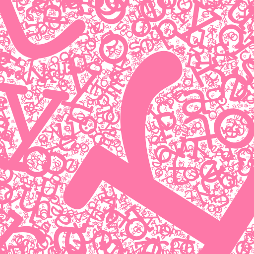

# Texty Fun Time 😙

Do you like words? No, scratch that. Not words, letters. Do you like letters, (characters, graphemes, _motherfucking sigils_, et goddamn cetera) but wish they weren't so unfairly constrained into words? Those oppressive prison cells of grammar, that's what I think of words. Who needs em! Not me. Haven't used one in years, and good riddence!

So why bother making word art. Boring 1997 Microsoft Word plugin word art. Dumb "256-color, curved across the arc of a circle, then shat upon by a dithered drop shadow" word art. When you could make a text mosaic.

(Obv I spent most of my youth playing with MS Word word art, because hot dang that was the coolest.)

# HOW DOES?

```javascript
var Canvas = require('canvas'); // if running in Node
var MAGNIFICENT_ARTWORKS = require('texty-fun-time');

var canvas = new Canvas(512, 512);
MAGNIFICENT_ARTWORKS.draw(canvas, {
  text: "ooh mickey you're so pretty can't you understand",
  color: 'rgb(253, 120, 168)',
  density: 2,
  startCentered: false,
  sizing: "random",
});
```



TextFunTime places letters where there is the least opacity on the canvas, so passing a canvas that already contains opaque (or partially opaque) pixels can create unexpected results.

`color` can be any [color string](https://developer.mozilla.org/en-US/docs/Web/CSS/color_value), gradient, or pattern that works with the canvas context's `fillStyle` property.

`sizing` can be one of `"random"`, `"linear"`, and `"logarithmic"`, which determines how subsequent letters are scaled down in size.

`density` is dangerous: it increases the number of painted letters exponentially, i.e. `ooh mickey you're so pretty can't you understand` is 48 characters, so this image has 2,304 chars on it.

# Terms of Use

This software is offered under the BITE-ME license, wherein you can do whatever the fuck you want with it, but if you @ me I will drive to your home and say mean words to you as I flick you in the eye.
